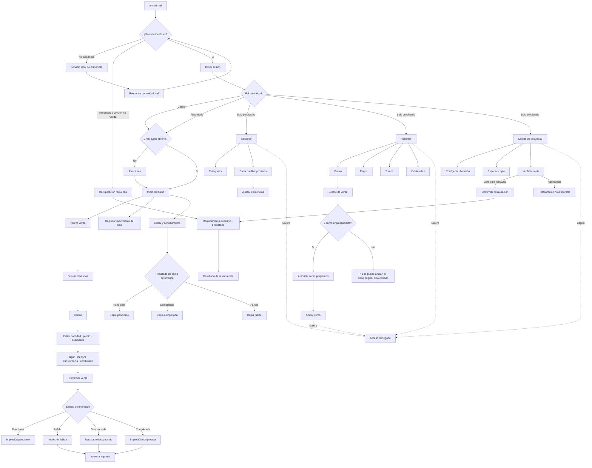

# Screen map for the approved Mundo Kawaii POS MVP

This map turns the approved planning artifacts into a reviewable Colombian-Spanish UI surface for one store, one Windows terminal, and two roles. It describes navigation and states only; it does not authorize implementation, choose a framework, database, Windows package, or print bridge.

## Review path

1. Follow the role-aware navigation diagram and confirm the cashier cannot enter owner areas.
2. Check the compact inventory against the linked capability specifications.
3. Walk the five end-to-end paths, especially durable sale confirmation before printing and shift closure before backup completion.
4. Confirm deferred flows and unresolved decisions remain outside the MVP screen set.

## Navigation principles

- **Shared operating shell:** owner and cashier see `Inicio`, `Venta`, `Turno` and `Cerrar sesión`; the owner additionally sees `Catálogo`, `Reportes` and `Copias de seguridad`.
- **State-dependent start:** after login, no active shift leads to `Abrir turno`; an active shift leads to `Inicio del turno`. Selling and cash movements require that active shift.
- **Local-first status:** `Sin conexión a Internet` is informational and does not block core work. Loss of the local service or failed integrity/version checks instead leads to `Servicio local no disponible` or `Recuperación requerida` and blocks operations safely.
- **Privileged boundaries:** hiding owner links is not authorization. Cashier attempts at owner-only routes or commands show `No tienes permiso para realizar esta acción` and make no business change.
- **Durable outcome first:** `Venta confirmada` is independent of `Impresión pendiente`, `Impresión fallida`, `Resultado desconocido` or `Impresión completada`. Likewise, a closed shift remains closed while its automatic backup is pending or failed.
- **Regional consistency:** all UI copy is Colombian Spanish; money is identified as COP; dates are day-first; displayed operational time uses `America/Bogota`; prices are final and no tax breakdown appears.

## Role-aware navigation

Dashed cashier paths represent denied direct access, not visible navigation choices. `Mantenimiento exclusivo` is also used for controlled recovery at startup; while it is active, sales, shift mutations, print-job mutations, and report requests are unavailable.

## Compact screen inventory

Legend: **P** = propietario, **C** = cajero. “Screen” includes a full page, task panel, modal, or durable outcome view when that distinction matters to the workflow.

| ID | Spanish UI label | Roles | Entry points | Primary actions | Critical states | Linked capability |
| --- | --- | --- | --- | --- | --- | --- |
| SYS-01 | `Iniciar sesión` | P, C | Local startup; session expiry; logout | Authenticate; retry; return after invalid credentials | Loading; `Credenciales no válidas`; offline Internet; session expired; local-service error | `access-control`, `offline-data-recovery` |
| SYS-02 | `Servicio local no disponible` | P, C | Startup/readiness failure; local connection loss | `Reintentar conexión local`; review safe diagnostic | Waiting; unavailable; unsupported schema; integrity failure; `Recuperación requerida` | `offline-data-recovery` |
| SYS-03 | `Acceso denegado` | P, C | Unauthorized route or command | `Volver al inicio` | Permission denied; no mutation; safe audit outcome | `access-control` |
| OPS-01 | `Abrir turno` | P, C | Login with no active shift; `Turno` | Enter `Efectivo inicial`; `Abrir turno` | Loading; invalid amount; second-shift conflict; success; error with no partial opening | `cash-shifts` |
| OPS-02 | `Inicio del turno` | P, C | Login with active shift; successful opening; main nav | `Nueva venta`; `Movimiento de caja`; `Cerrar turno`; inspect current expected cash | Active shift restored after restart; offline Internet; loading; stale/error; clock warning | `cash-shifts`, `offline-data-recovery` |
| OPS-03 | `Registrar movimiento de caja` | P, C | Active-shift dashboard | Select `Ingreso` or `Retiro`; enter COP amount and `Motivo`; save | Required/invalid fields; no active shift; close conflict; success; error with unchanged expected cash | `cash-shifts` |
| OPS-04 | `Cerrar y conciliar turno` | P, C | Active-shift dashboard | Review expected cash and components; enter `Efectivo contado`; `Cerrar turno` | Missing count; backup location unavailable/not configured; concurrent mutation; closing; closed | `cash-shifts`, `reports-reconciliation` |
| OPS-05 | `Resultado de copia automática` | P, C view closure outcome; P recovery actions | Successful shift closure | View status, attempted/completion time and destination; P enters backup recovery/export | `Copia pendiente`; `Copia completada`; `Copia fallida`; closed shift always unchanged | `cash-shifts`, `offline-data-recovery` |
| CHK-01 | `Nueva venta` | P, C | Active-shift dashboard; main nav | Open search; review cart; abandon cart; continue to payment | Empty cart; loading; offline Internet; product became inactive/stale; no active shift | `sales-checkout`, `catalog-inventory` |
| CHK-02 | `Buscar productos` | P, C | New sale/cart | Search local active catalog; add product | Empty result; loading; search error; inactive product blocked; out of stock; offline Internet | `sales-checkout`, `catalog-inventory`, `offline-data-recovery` |
| CHK-03 | `Editar producto de la venta` | P, C | Cart line | Change `Cantidad`; `Cambiar precio unitario`; `Aplicar descuento`; `Quitar producto` | Invalid quantity/price/discount; insufficient stock warning; recalculated total; no stock mutation | `sales-checkout`, `catalog-inventory` |
| CHK-04 | `Pagar` | P, C | Non-empty valid cart | Choose `Efectivo`, `Transferencia` or `Pago combinado`; enter amounts/reference; review change | Unsettled amount; missing transfer reference; invalid component; `Cambio`; exact settlement | `sales-checkout` |
| CHK-05 | `Confirmar venta` | P, C | Settled payment | Review lines, effective prices, discounts, payment breakdown and total; confirm once | Confirming; insufficient stock; shift closed/missing; atomic failure/no effects; uncertain response/retry; success | `sales-checkout`, `catalog-inventory`, `cash-shifts` |
| CHK-06 | `Venta confirmada` | P, C | Durable confirmation response or idempotent retry | View sale number; start another sale; view print status | Confirmed exactly once; `Impresión pendiente`; offline Internet | `sales-checkout`, `tickets-printing` |
| PRT-01 | `Estado de impresión` | P, C | Confirmed sale; sale detail; print notification | View attempt; `Volver a imprimir`; deliberately retry an ambiguous result | `Impresión pendiente`; `Impresión completada`; `Impresión fallida`; `Resultado desconocido`; printer unavailable | `tickets-printing` |
| PRT-02 | `Vista del comprobante` | P, C | Confirmed sale; print/reprint request | Review retained ticket data; `Imprimir de nuevo` | Loading; output failure; historical snapshot available; no duplicate sale | `tickets-printing`, `colombia-regional-behavior` |
| CAT-01 | `Productos` | P | Owner nav `Catálogo` | Search/filter; `Crear producto`; open edit; view stock/status | Empty catalog; loading; error; active/inactive; duplicate/stale edit feedback | `catalog-inventory` |
| CAT-02 | `Categorías` | P | `Catálogo`; product form | Create/edit category; choose category | Empty; loading; error; referenced deletion restricted; inactive/deactivated where supported | `catalog-inventory` |
| CAT-03 | `Crear producto` / `Editar producto` | P | Product list | Set name, SKU/código, optional barcode, final COP price, category, opening stock on creation, active status; save | Required fields; duplicate SKU/barcode; invalid exact quantity; stale revision; save success/error | `catalog-inventory`, `colombia-regional-behavior` |
| INV-01 | `Ajustar existencias` | P | Product detail/list | Choose `Aumentar` or `Disminuir`; enter quantity and reason; confirm | Invalid fields; decrease would be negative; stale balance; success with previous/resulting balance; denied | `catalog-inventory`, `access-control` |
| RPT-01 | `Reporte de ventas` | P | Owner nav `Reportes` | Filter date/range; inspect status; open sale | Empty period; loading; error; `Completada`; `Anulada`; day-first dates | `reports-reconciliation` |
| RPT-02 | `Reporte de pagos` | P | Reports | Filter date/range; review `Efectivo` and `Transferencia` totals/components | Empty; loading; error; split components; void reversals; retained transfer reference | `reports-reconciliation` |
| RPT-03 | `Reporte de turnos` | P | Reports | Open active/closed shift; inspect opening, movements, cash sales/refunds, expected, counted and difference | Empty; active with count unavailable; closed immutable; loading/error; reconciliation mismatch warning | `reports-reconciliation`, `cash-shifts` |
| RPT-04 | `Reporte de existencias` | P | Reports | Search/filter products; review current balance | Empty; loading; error; zero stock; reconciliation mismatch warning | `reports-reconciliation`, `catalog-inventory` |
| SAL-01 | `Detalle de venta` | P; C only through the permitted reprint lookup boundary | Sales report (P); confirmed-sale/reprint lookup (P, C) | Review retained ticket data and status; print/reprint; P evaluates void eligibility and full report detail | Loading/error; completed/voided; print states; original shift open/closed | `sales-checkout`, `tickets-printing`, `reports-reconciliation` |
| VOD-01 | `Autorizar como propietario` | P | Eligible completed sale detail while original shift is open | Enter fresh owner credentials; continue or cancel | Invalid/expired authorization; deactivated owner; permission denied; no mutation | `access-control`, `sales-checkout` |
| VOD-02 | `Anular venta` | P | Successful owner step-up | Review original payment components and stock restoration; enter `Motivo`; `Confirmar anulación` | Original shift closed; already voided; missing reason; atomic failure; success; no return/exchange option | `sales-checkout`, `cash-shifts` |
| VOD-03 | `Venta anulada` | P | Successful void | Review owner, reason, time, exact payment reversals, restored quantities and report effect | Cash/transfer/split-specific effects; preserved original sale; completed exactly once | `sales-checkout`, `reports-reconciliation` |
| BAK-01 | `Copias de seguridad` | P | Owner nav; failed/pending closure backup | List artifacts/jobs; inspect destination/status; enter config/export/verify/restore | Empty; loading; error; pending/completed/failed/incomplete; offline Internet | `offline-data-recovery` |
| BAK-02 | `Configurar ubicación de copias` | P | Backup center | Select location; run non-destructive writeability check; save | Checking; accepted; unavailable/not writable; invalid path; unchanged live data/existing backups | `offline-data-recovery` |
| BAK-03 | `Exportar copia` | P | Completed artifact detail | Select destination; export a copy | Exporting; completed; failed; source artifact and live data unchanged | `offline-data-recovery` |
| BAK-04 | `Verificar copia` | P | Backup artifact detail | Start verification; inspect completeness, version, integrity and isolated-restore checks | Pending/running; check-specific failure; `Lista para restaurar`; `Copia rechazada`; no live mutation | `offline-data-recovery` |
| BAK-05 | `Confirmar restauración` | P | Exact artifact marked restore-ready | Re-authenticate; review artifact digest/identity and impact; explicitly confirm | Verification stale/missing; credentials rejected; cancel; entering maintenance | `offline-data-recovery`, `access-control` |
| BAK-06 | `Mantenimiento exclusivo` | P | Confirmed restore; startup recovery path | Observe staging/checks/swap; no business action available | Preparing; validating; replacing; rolling back; interruption recovery; operations locked | `offline-data-recovery` |
| BAK-07 | `Resultado de restauración` | P | Restore completion or failure | Review recovered/unchanged outcome; return to readiness when safe | Success with consistent recovered state; failure with unchanged or rolled-back live state; recovery required | `offline-data-recovery` |

## Cross-screen state contract

These states are patterns, not extra capabilities:

| State | Colombian-Spanish presentation | Required behavior |
| --- | --- | --- |
| Empty | `Aún no hay ventas para este periodo`, `No se encontraron productos`, or context-equivalent copy | Explain what is empty and offer only an allowed next action. Never imply an error. |
| Loading | `Cargando…`, `Confirmando venta…`, `Verificando copia…` | Prevent accidental duplicate submission while preserving an idempotent retry path after uncertainty. |
| Recoverable error | `No se pudo completar la acción. No se realizaron cambios.` | Name the failed operation and whether state stayed unchanged; retain entered data when safe. |
| Offline Internet | `Sin conexión a Internet. Puedes seguir trabajando en este equipo.` | Remain informational for authentication and core selling-day actions; never masquerade as loss of the local service. |
| Local service unavailable | `No se puede conectar con el servicio local.` | Block business commands, offer local retry/diagnostic recovery, and never initialize empty data over unreadable data. |
| Permission denied | `No tienes permiso para realizar esta acción.` | Make no business mutation; return to a permitted destination. |
| No active shift | `Debes abrir un turno antes de confirmar una venta.` | Guide P/C to `Abrir turno`; preserve cart state only if later product behavior explicitly supports it. |
| Stale/conflicting state | `La información cambió. Revisa los datos e inténtalo de nuevo.` | Refresh authoritative local state and avoid partial effects. |

## Five primary end-to-end UX paths

### 1. Start an offline selling day

1. The cashier launches locally with Internet unavailable and sees `Sin conexión a Internet. Puedes seguir trabajando en este equipo.`
2. `Iniciar sesión` authenticates the named cashier against the local service.
3. With no active shift, the shell routes to `Abrir turno`; the cashier records `Efectivo inicial` in COP.
4. Success routes to `Inicio del turno`, showing the retained opening identity/time and current expected cash.
5. After a normal restart, login returns to the same active shift and confirmed operational state without duplication.

### 2. Complete and print a sale

1. From `Inicio del turno`, the cashier selects `Nueva venta`, uses `Buscar productos`, and adds only active products.
2. In `Carrito`, the cashier changes quantity, removes a line, uses `Cambiar precio unitario`, and applies `Descuento explícito`; totals recalculate while stock remains unchanged.
3. In `Pagar`, the cashier chooses `Efectivo`, `Transferencia` with `Referencia`, or `Pago combinado`; only a settled breakdown enables `Confirmar venta`.
4. Confirmation either applies sale, lines, payments, stock and shift effects completely, or shows a no-change failure such as insufficient stock.
5. Durable success shows `Venta confirmada` and then the independent print state. `Impresión fallida` permits `Volver a imprimir`; `Resultado desconocido` requires a deliberate decision and is never silently retried. Reprint uses retained ticket data and never creates another sale.

### 3. Operate and reconcile the cash shift

1. From `Inicio del turno`, owner or cashier opens `Registrar movimiento de caja`, chooses `Ingreso` or `Retiro`, and supplies a positive COP amount and `Motivo`.
2. The dashboard reflects expected cash as opening cash plus net cash sales plus deposits minus withdrawals minus valid cash void reversals; transfer components do not affect physical expected cash.
3. The operator chooses `Cerrar y conciliar turno`, reviews the components, and records `Efectivo contado`.
4. Closure retains expected cash, counted cash, `Diferencia`, user and time, makes the shift inactive, and creates exactly one automatic backup job.
5. `Resultado de copia automática` displays `Copia pendiente`, `Copia completada`, or `Copia fallida` with destination and time. A failure never reopens or changes the closed shift; owner recovery continues in `Copias de seguridad`.

### 4. Void an eligible completed sale

1. The owner opens `Reporte de ventas` and then `Detalle de venta` for a completed, non-voided sale.
2. The UI checks and clearly displays whether the **original** shift is still open. A closed original shift shows `No se puede anular: el turno original está cerrado` and offers no correction workaround.
3. An eligible action opens `Autorizar como propietario`; fresh owner authorization is attributed to that owner without changing the original cashier attribution.
4. `Anular venta` requires `Motivo` and previews exact stock restoration and the original cash/transfer component reversals.
5. `Venta anulada` preserves the original sale, marks it voided, restores stock exactly once, adjusts expected cash only by original net cash, updates reports, and retains the audit identity. Repeated voids, returns, exchanges, and post-close correction are unavailable.

### 5. Protect and recover local data

1. The owner opens `Configurar ubicación de copias`; the system accepts a location only after a non-destructive writeability check and does not move live data or existing backups.
2. In `Copias de seguridad`, the owner may `Exportar copia`; export copies a completed artifact without changing its source or live state.
3. `Verificar copia` reports completeness, supported version, integrity, and isolated-restore checks separately. Only all-pass checks for the exact artifact show `Lista para restaurar`.
4. `Confirmar restauración` requires owner re-authentication and explicit confirmation, then enters `Mantenimiento exclusivo`; all ordinary business and report actions remain locked.
5. The result is either a mutually consistent recovered dataset or a visible failure with no partially mixed dataset exposed. Safe rollback/recovery completes before returning to `Iniciar sesión` or the restored active-shift state.

## MVP versus deferred flows

### Included MVP screens

- Named local login for owner/cashier; role-aware operations and owner administration.
- One active shift, cash movements, reconciliation, and observable closure backup.
- Local catalog search, editable cart, cash/transfer/split settlement, atomic confirmation, ticket status and reprint.
- Owner catalog/category/product management, stock adjustment, four basic report views, eligible owner-authorized void, and backup configuration/export/verification/restore.
- Offline, restart, local-service recovery, permission, empty/loading/error, printing, backup and exclusive-maintenance states described above.

### Explicitly deferred — no MVP screen or navigation entry

- Siigo integration/migration/parity; cloud authority; multiple stores or terminals; synchronization or conflict resolution.
- Card or payment-terminal flows, customer credit, and payment methods beyond cash and transfer.
- Tax configuration/breakdown, fiscal integration, full accounting, supplier or purchase-order flows.
- Returns, exchanges, post-close corrections, loyalty, ecommerce, and advanced analytics.
- Draft-cart recovery after restart, backup scheduling beyond shift closure/owner export, and exactly-once physical-paper guarantees.
- Framework, database, Windows packaging, archive/digest implementation, and print bridge selection.
- User-administration and credential-recovery screens until their product/security boundary is explicitly decided.

## Unresolved design notes

These notes preserve approved uncertainty; they are not new scope:

1. **Owner access lifecycle:** initial owner provisioning, offline owner credential recovery, password/session values, lockout safeguards, and whether owners manage other users require an explicit security decision before those screens can be mapped.
2. **Quantity entry:** exact quantity precision and input increments depend on validated merchandise units; the map intentionally labels `Cantidad` without choosing whole or fractional behavior.
3. **Printing:** the screen states are provider-neutral. Only selection, integration, and shipment of the production printer provider/adapter remain blocked until one approach passes and is explicitly accepted through the real Windows-terminal and USB-printer proof of concept. This gate does not block provider-neutral ticket snapshots, print jobs, UI recovery, or retries, nor an isolated proof-of-concept harness after the base runtime and test foundation exists. All implementation still requires later authorization.
4. **Backup operations:** archive/container, digest algorithms, retention, encryption/key recovery, and destination-separation policy remain unselected; the UI map specifies observable outcomes, not those mechanisms.
5. **Restore and startup diagnostics:** implementation must provide actionable Colombian-Spanish recovery details without leaking sensitive data, but exact support codes and operational escalation copy depend on later packaging and operations decisions.
6. **Cashier access to historical reprint discovery:** the capability permits cashier reprint of a confirmed sale, while owner reports are owner-only; the minimal permitted cashier-side lookup/navigation boundary must be settled without exposing owner reporting.
