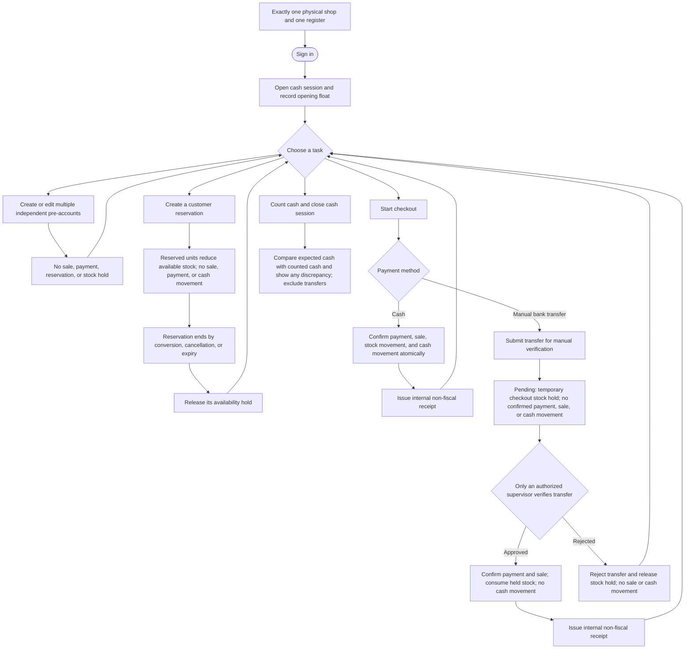

# MVP User and System Flows

## User flow



## System sequence

```mermaid
sequenceDiagram
    autonumber
    actor Cashier
    actor Supervisor
    participant POS
    participant DB as System of record
    participant Receipt

    Note over POS,DB: MVP scope: exactly one physical shop and one register.
    Cashier->>POS: Sign in
    POS->>DB: Authenticate and verify cashier role
    DB-->>POS: Authenticated session and permissions
    POS-->>Cashier: Show register
    Cashier->>POS: Open cash session with opening float
    POS->>DB: Create open cash session
    DB-->>POS: Cash session opened

    loop Any number of independent pre-accounts
        Cashier->>POS: Create or edit a pre-account
        POS->>DB: Save pre-account only
        DB-->>POS: Saved without sale, collection, stock, or cash records
    end

    Cashier->>POS: Reserve items for a customer
    POS->>DB: Check availability and create customer reservation
    DB-->>POS: Reservation recorded; available stock reduced
    Note over POS,DB: Reservation creates no sale, collection, payment, stock movement, or cash movement.

    Cashier->>POS: Start cash checkout
    POS->>DB: Atomically validate stock and record confirmed cash payment, collection, sale, stock movement, and cash movement
    DB-->>POS: Commit all cash-checkout records together or commit none
    POS->>Receipt: Render receipt for confirmed sale
    Receipt-->>Cashier: Internal non-fiscal receipt

    Cashier->>POS: Submit manual bank-transfer checkout
    POS->>DB: Check availability; create pending collection and temporary checkout stock hold
    DB-->>POS: Pending; no confirmed payment, sale, stock movement, or cash movement
    Note over POS,DB: A pending transfer is never a confirmed sale or physical cash.
    Supervisor->>POS: Sign in
    POS->>DB: Authenticate supervisor
    DB->>DB: Verify supervisor/admin authorization
    DB-->>POS: Authenticated session with authorized supervisor/admin role
    POS-->>Supervisor: Show transfer verification
    Supervisor->>POS: Review transfer and submit approve/reject decision
    POS->>DB: Validate supervisor/admin authorization and record decision
    Note over POS,DB: Database role enforcement is required; UI-only permission is insufficient.
    alt Transfer approved
        DB-->>POS: Confirm payment and sale; consume held inventory; record stock movement, no cash movement
        POS->>Receipt: Render receipt for confirmed sale
        Receipt-->>Cashier: Internal non-fiscal receipt
    else Transfer rejected
        DB-->>POS: Mark collection rejected and release hold; no sale, payment, or cash movement
        POS-->>Cashier: Transfer rejected; held stock is available again
    end

    Cashier->>POS: Count cash and close cash session
    POS->>DB: Close session and calculate expected cash from opening float and cash movements
    DB-->>POS: Expected cash; transfer collections excluded
    POS-->>Cashier: Show expected cash, counted cash, and discrepancy
```
