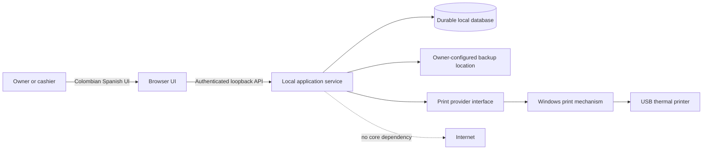
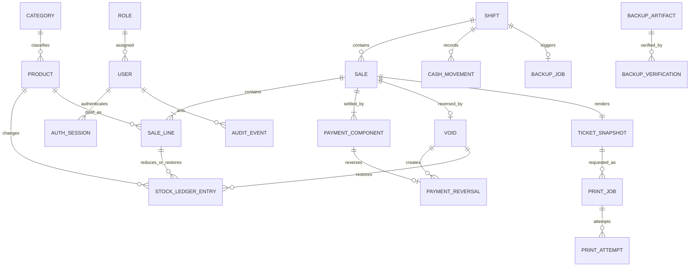
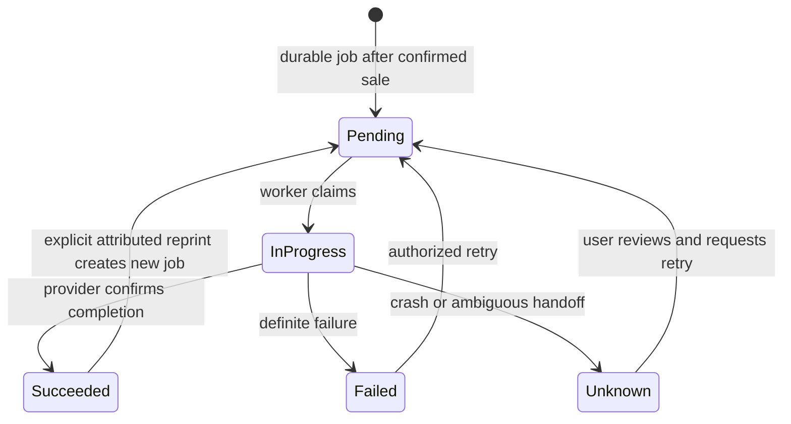
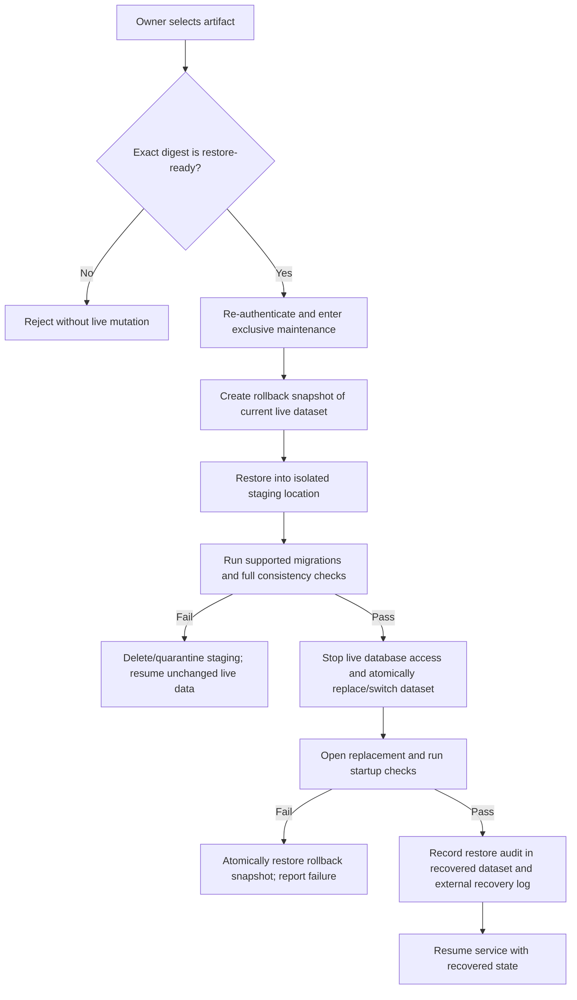
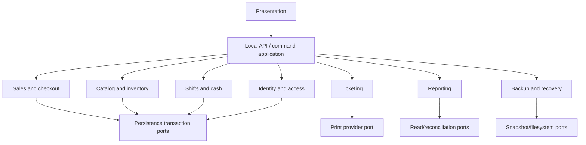

# Design: Offline-first MVP foundations

## Decision summary

Build the MVP as a single-terminal local system: a Colombian-Spanish browser UI talks only to a local application service, which owns all authorization and business transactions in one durable local relational database. The local service also owns backup orchestration and delegates printing through an unselected provider interface. Sale confirmation commits before any print attempt. Auditable source records are authoritative; stock, shift, and report read models are projections that can be reconciled or rebuilt from those records.

This is a planning design, not implementation authorization. Framework, database vendor, Windows packaging, and print bridge remain unselected. Printing and its proof of concept are optional, deferable work streams that MUST NOT block MVP implementation, acceptance, or delivery. Provider-neutral ticket records may proceed independently. A provider may be explored or integrated without creating a support claim, but printing must remain labeled unavailable or unverified until retained evidence from the actual terminal and printer demonstrates the claimed behavior.

## Review path

1. Review the deployment and authority boundaries.
2. Verify the transaction tables and workflow diagrams against the specifications.
3. Verify backup replacement and print-failure behavior.
4. Use the traceability matrix to check all eight capabilities.
5. Confirm the deferred decisions remain deferred before task planning.

## Context and constraints

| Constraint | Design consequence |
| --- | --- |
| One store, one Windows terminal, one local dataset | No distributed consistency, cloud dependency, synchronization, or conflict resolution is introduced. |
| Core operation without Internet | Authentication, catalog, shifts, checkout, reports, ticket generation, supported printing, and recovery use local resources only. |
| One active shift | The database enforces at most one open shift, not merely the UI. |
| Strict non-negative stock | Stock is checked and changed in the same transaction as sale confirmation or adjustment. |
| COP, Colombian Spanish, `America/Bogota` | Money, messages, civil dates, tickets, reports, and backup metadata use fixed regional rules. |
| Direct USB thermal printing on Windows | Printing crosses a hardware boundary behind a provider contract, may be deferred without blocking MVP delivery, and requires real-hardware evidence before a working/support claim. |
| Local data is business-critical | Durable commits, integrity checks, observable backups, isolated restore validation, and safe replacement are required. |
| MVP scope | No Siigo integration, multi-terminal operation, returns, exchanges, tax engine, card processing, or post-close corrections. |

## Deployment shape

### Recommended containers



- **Browser UI:** presentation, input, cart editing, and recoverable status display. It never writes the database or printer directly.
- **Local application service:** the only business-authority boundary. It authenticates users, authorizes commands, owns transactions, renders immutable ticket payloads, runs recovery checks, and exposes local APIs.
- **Durable local database:** one ACID-capable relational store with constraints and transactional journals. Its vendor is deferred.
- **Print provider:** an optional, replaceable local adapter. It receives already-durable print jobs and never confirms sales; without accepted actual-hardware evidence, it remains unavailable or unverified.
- **Backup location:** owner-configured local or attached storage accepted only after a writeability probe. It is not the live database location.

The service should bind to loopback by default and start with Windows before, or together with, the UI launcher. A packaged browser shell may improve startup and kiosk behavior, but it must remain a presentation host; it must not absorb domain transactions or make the print approach implicit.

### Tradeoffs considered

| Option | Advantages | Rejection or condition |
| --- | --- | --- |
| Browser-only/PWA with browser storage | Simple distribution and UI development | Rejected for primary ownership: browser lifecycle, storage durability, safe restore, process-level printing, and silent USB control are inadequate authority boundaries. |
| Browser UI + local service + local database | Clear transaction owner, restart recovery, local API, backup control, and provider-based printing | Recommended. Adds a local service lifecycle and packaging burden that must be operationally tested. |
| Monolithic desktop UI with embedded domain and data access | Single package and direct OS access | Not selected now. It couples UI lifecycle to transaction and recovery concerns and makes provider boundaries easier to bypass. A desktop shell may still host the browser UI. |
| Cloud-backed web application | Centralized operations | Rejected for MVP because core selling-day operation cannot depend on connectivity. |

## Authority and data flow

1. The UI submits a command with the authenticated session, an idempotency key, and any expected record revision.
2. The application service revalidates identity, role, command shape, and current business state.
3. One database transaction writes authoritative records and any required synchronous balance/read-model updates.
4. The service returns the durable outcome. Retries with the same identity and idempotency key return the prior outcome rather than repeat effects.
5. Post-commit work such as printing or backup execution is represented by a durable job. A worker performs it and records every attempt.
6. Reports read retained operational records or rebuildable projections; they do not infer business facts from UI state or printer status.

## Domain model

All identifiers are locally generated, opaque, and stable. Monetary values are integer COP units; floating-point arithmetic is prohibited. Quantities use a documented exact numeric representation appropriate to the catalog policy. Every mutable administrative record has a revision for stale-write detection. Operational timestamps retain an absolute instant; user-facing civil dates are derived in `America/Bogota`.



### Identity and catalog

| Entity | Required responsibility and relationships |
| --- | --- |
| `Role` | Fixed MVP roles `OWNER` and `CASHIER`; permissions are policy, not UI flags. |
| `User` | Local identity, role, active state, credential hash metadata, creation/update metadata. Historical attribution survives deactivation. |
| `AuthSession` | Local, expiring session tied to one user; revocable and not accepted after user deactivation. |
| `Category` | Owner-managed product grouping with stable identity. Deletion is restricted when referenced; deactivation is preferred. |
| `Product` | Name, unique SKU/code, optional unique barcode when present, category, final COP price, active state, and current stock projection. Historical sale lines never depend on later product edits. |

### Sales, stock, and payments

| Entity | Required responsibility and relationships |
| --- | --- |
| `Sale` | Unique human-readable sale number, original shift, status `COMPLETED` or `VOIDED`, cashier/confirming user, confirmation instant, totals, and immutable regional snapshot fields. |
| `SaleLine` | Product reference plus retained product description/code, quantity, catalog unit price, effective unit price, explicit discount details, line total, and actors responsible for price override/discount. |
| `PaymentComponent` | One `CASH` or `TRANSFER` component. Cash retains tendered, change, and net amount; transfer retains amount and required reference. Components sum to the sale total using net cash. |
| `StockLedgerEntry` | Append-only source record with product, signed quantity, reason type (`OPENING`, `SALE`, `VOID`, `ADJUSTMENT`), source identifier, actor, instant, previous balance, and resulting balance. Product creation writes an `OPENING` entry, including a zero balance, so every current balance is rebuildable. A uniqueness key prevents the same source effect twice. |
| `StockAdjustment` | Owner command record with direction, positive quantity, reason, actor, instant, and linked stock ledger entry. It never bypasses the ledger. |
| `Void` | At most one per sale; owner, reason, instant, original open shift, and links to exact stock/payment reversals. The sale remains retained and becomes `VOIDED`. |
| `PaymentReversal` | One per original payment component, carrying the exact original retained amount and type. Transfer reference remains available through the original component. |

`Product.current_stock` is the fast current-balance projection. The stock ledger is the audit source. Each stock-changing transaction inserts the ledger entry and updates the product projection together, while checking `resulting_balance >= 0` and `previous_balance` against the locked current projection.

### Shifts and cash

| Entity | Required responsibility and relationships |
| --- | --- |
| `Shift` | Status `OPEN` or `CLOSED`, opening amount/user/instant, and on close the retained expected amount, counted amount, counted-minus-expected difference, closing user/instant, and revision. |
| `CashMovement` | Deposit or withdrawal against an open shift, positive amount, required reason, actor, and instant; immutable after insertion. |
| `ShiftCashEffect` | Optional explicit append-only projection journal for opening cash, net cash sale components, deposits, withdrawals, and cash void reversals. Each source effect is unique. If omitted physically, the same model is a deterministic query over source records. |

Expected cash is always:

`opening cash + net cash sale components + deposits - withdrawals - voided net cash components`.

Transfer components and transfer reversals are excluded. At closure, this derived amount is retained as the immutable expected-cash snapshot used for reconciliation.

### Tickets, backups, and audit

| Entity | Required responsibility and relationships |
| --- | --- |
| `TicketSnapshot` | Exactly one immutable render model per confirmed sale containing store identity, sale number/time, cashier, lines, effective prices, payments, change, COP and locale metadata. It is created only after/with durable confirmation and is unaffected by later catalog edits. |
| `PrintJob` | References a ticket snapshot and request type (`INITIAL` or `REPRINT`), requester, idempotency key, state, and timestamps. Initial job uniqueness is scoped to the sale; deliberate reprints are separately attributed requests. |
| `PrintAttempt` | Append-only attempt number, provider, start/end, result (`SUCCEEDED`, `FAILED`, `UNKNOWN`), diagnostic code, and non-sensitive message. |
| `BackupJob` | `SHIFT_CLOSE` trigger, related closed shift, configured destination snapshot, database commit/high-watermark, state, attempts, and observable outcome. The job is unique per closed shift. Owner export copies a completed artifact and does not masquerade as another closure backup. |
| `BackupArtifact` | Immutable artifact identity, format/data versions, creation instant, scope manifest, record counts, integrity digest(s), destination, size, and completion state. |
| `BackupVerification` | Owner, artifact digest, check-by-check metadata/integrity/isolated-restore results, time, and final `RESTORE_READY` or `REJECTED` result. A result applies only to the exact artifact digest. |
| `AuditEvent` | Append-only actor, action, target type/id, instant, command/correlation ID, outcome, and safe before/after or reason metadata. It complements, not replaces, domain journals. |

Audit coverage includes successful and denied privileged commands, authentication outcomes without credential contents, product changes, stock adjustments, cash movements, price overrides, discounts, confirmations, voids, shift open/close, backup configuration/export/verification/restore, and print/reprint requests. Secrets, credential hashes, and unnecessary payment-reference content must not be copied into diagnostic logs.

## Transaction boundaries and invariants

| Command | One transaction includes | Must remain outside |
| --- | --- | --- |
| `OpenShift` | Validate authenticated cashier/owner, enforce no open shift, insert shift and opening cash effect/audit | Backup and printing |
| `CreateProduct` | Owner authorization; validate catalog fields and uniqueness; insert product plus its `OPENING` stock ledger entry and audit | Search-index/report optimization |
| `ConfirmSale` | Lock/revalidate open shift and products; validate active products, quantities, totals, settlement, transfer references, and stock; insert sale, immutable lines, payment components, stock ledger entries, stock projections, shift cash effects, ticket snapshot, audit, and durable initial print job | Physical printing |
| `AdjustStock` | Owner authorization; lock product; validate reason/quantity/non-negative result; insert adjustment and ledger; update stock projection; audit | Reporting refresh not required for correctness |
| `RecordCashMovement` | Validate actor and open shift; insert movement and cash effect; audit | Any physical cash action outside system observation |
| `VoidSale` | Fresh owner authorization; lock sale, original shift, and products; require completed/non-voided sale and open original shift; insert one void, exact payment reversals, restoring stock entries, cash reversal if applicable; mark sale voided; update projections; audit | Refund execution outside recorded cash handling; ticket printing |
| `CloseShift` | Lock open shift; require a configured backup destination and counted cash; derive/reconcile expected cash; retain closure fields; make shift inactive; insert a unique backup job with the closure commit/high-watermark and destination snapshot; audit | Copying backup bytes to destination |
| `RequestPrint` | Validate confirmed sale and actor; resolve immutable snapshot; insert or return idempotent print job; audit | Provider invocation |
| `ConfigureBackupLocation` | Owner authorization; retain accepted destination after a non-destructive writeability probe; audit | Moving/deleting live data or old backups |
| `VerifyBackup` | Owner authorization; register requested artifact and durable result metadata | Validation database/state, which is isolated from live state |
| `RestoreBackup` | Owner authorization and matching restore-ready artifact digest; enter exclusive maintenance/recovery state and record intent | Dataset staging and swap use the controlled replacement protocol below, not normal business transactions |

### Enforced invariants

- At most one `OPEN` shift exists.
- Sale confirmation requires exactly one current open shift and a settled payment breakdown.
- Cash net amount equals tendered minus change; all amounts are non-negative, and each transfer has a non-empty reference.
- Sale total equals retained line totals after explicit discounts and overrides; no tax component exists.
- A stock balance never becomes negative, and each sale line, void line, or adjustment changes it at most once.
- A completed sale, its lines, payments, and original shift association are immutable. A void changes status and appends reversals; it does not rewrite history.
- A void is unique per sale, owner-authorized, reasoned, and allowed only while the original shift is open.
- Closed-shift financial records and reconciliation snapshots are immutable.
- Command idempotency is enforced terminal-wide by `(command type, idempotency key)` plus unique domain source keys. The retained command record includes actor and payload digest; reuse with a different actor or payload is rejected, while an authorized retry after restart can retrieve the original outcome.
- A print request can never create or alter sale, stock, payment, or shift effects.
- A close-triggered backup job is created exactly once per successfully closed shift. Backup execution may fail and be retried without reopening or altering that shift.

Database constraints provide the final guard; service checks provide actionable Colombian-Spanish messages. Concurrency is low but not assumed absent: commands use transactions, conditional revisions, row-level or equivalent write serialization, and uniqueness constraints rather than UI sequencing.

## Critical flows

### Sale confirmation and printing

```mermaid
sequenceDiagram
    actor C as Cashier/Owner
    participant UI as Browser UI
    participant S as Local service
    participant DB as Local database
    participant PW as Print worker/provider

    C->>UI: Confirm settled cart
    UI->>S: ConfirmSale(idempotency key, cart, payments)
    S->>DB: Begin; lock open shift/products
    S->>DB: Validate and write sale, lines, payments,
    S->>DB: stock/shift effects, ticket snapshot, print job, audit
    alt any invariant or durable write fails
        S->>DB: Roll back all effects
        S-->>UI: Rejected/recoverable failure
    else commit succeeds
        S->>DB: Commit
        S-->>UI: Confirmed sale number and print-pending status
        PW->>DB: Claim durable print job
        PW->>PW: Invoke accepted provider
        PW->>DB: Append attempt and result
        PW-->>UI: Observable success/failure when refreshed
    end
```

A normal retry after an uncertain UI response uses the same idempotency key and receives the original confirmed sale. The worker never reconstructs a new sale; it prints the retained ticket snapshot.

### Void

```mermaid
sequenceDiagram
    actor O as Owner
    participant S as Local service
    participant DB as Local database

    O->>S: VoidSale(sale, reason, owner authorization)
    S->>DB: Begin; lock sale, original shift, products
    S->>DB: Require completed, not voided, original shift open
    S->>DB: Append void and exact payment reversals
    S->>DB: Append stock restorations and cash reversal
    S->>DB: Mark sale voided; update projections; audit
    alt any check/write fails
        S->>DB: Roll back every void effect
        S-->>O: Rejected; original state preserved
    else commit succeeds
        S->>DB: Commit
        S-->>O: Voided once with audit identity
    end
```

### Shift close and automatic backup

```mermaid
sequenceDiagram
    actor C as Cashier/Owner
    participant S as Local service
    participant DB as Local database
    participant BW as Backup worker
    participant F as Configured destination

    C->>S: CloseShift(counted cash)
    S->>DB: Begin; lock open shift
    S->>DB: Derive expected cash and retain reconciliation
    S->>DB: Close shift + create unique backup job + audit
    S->>DB: Commit
    S-->>C: Shift closed; backup pending
    BW->>DB: Create consistent backup snapshot and manifest
    BW->>F: Write temporary artifact, flush, verify, finalize
    alt completed
        BW->>DB: Record artifact, destination, completion time, success
    else destination/copy/verification fails
        BW->>DB: Record failure, attempted time, destination, diagnostics
        Note over DB: Closed shift and live data stay unchanged
    end
```

The shift close is durable before external I/O. This matches the required failure case: a backup failure is visible and recoverable but does not reopen or corrupt the shift. The UI must prominently show `pending`, `completed`, or `failed` and offer owner recovery/export actions; it must never label a failed attempt completed.

### Print recovery



No generic print API can guarantee exactly-once physical paper output across a crash after the device accepts bytes but before acknowledgment. The design guarantees idempotent business effects and durable attempt history, not impossible physical exactly-once delivery. Ambiguous attempts become `UNKNOWN`; the UI does not silently retry them. An authenticated owner or cashier may deliberately retry/reprint from the same ticket snapshot, accepting the possibility of a duplicate paper copy without duplicating the sale.

## Authentication, authorization, and security

### Boundary rules

- The local service, not the browser, validates credentials and permissions for every command.
- Credentials are stored only as salted, adaptive password hashes with versioned parameters. Plaintext credentials are never retained or logged.
- Sessions use unpredictable identifiers, inactivity and absolute expiry, secure local storage semantics, request-forgery protection, and explicit logout. Exact transport/packaging controls must match the selected local host model.
- The service binds to loopback unless a later approved scope change introduces networking. Database and backup paths are not directly served to the browser.
- Owner-only: catalog/category management, stock adjustment, eligible void authorization, reports, backup configuration, export, verification, and restore.
- Owner or cashier: authentication, shifts, carts, checkout, cash movements, initial printing, and reprinting.
- A privileged action uses the identity authenticated when that action is submitted. Owner step-up for a void creates a short-lived authorization context attributable to the owner; it does not rewrite the sale cashier or prior cart actors.
- Authorization failure performs no domain mutation and emits a safe audit outcome.
- Restore runs in exclusive maintenance mode after re-authentication and explicit owner confirmation. No sale, shift, print-job mutation, or report request may race with replacement.

Initial owner provisioning, owner credential recovery, password policy values, session durations, and whether owners may manage other user accounts are not specified product capabilities. They require an explicit security decision before implementation tasks; no insecure default or shared account may be assumed.

### Local threat controls

Use least-privilege Windows service and data-directory permissions; protect database, credential, backup configuration, and logs from ordinary user modification; sign/package executable components; validate all local API inputs; avoid command execution from printer or backup fields; normalize and constrain owner-selected paths; and never trust backup manifests before integrity and schema checks. Full-disk or backup encryption is a deployment/security decision, not silently assumed by this design.

## Offline startup and restart behavior

1. Windows starts the local service without waiting for network availability.
2. The service acquires a single-instance lock, opens the database, validates supported schema/version and integrity prerequisites, and completes database-native crash recovery.
3. It checks projection consistency markers and durable jobs. Safe pending jobs resume; ambiguous print attempts become `UNKNOWN` rather than being silently replayed.
4. The UI waits for a local readiness endpoint and then permits local authentication. It displays an actionable Colombian-Spanish recovery screen if the service is unavailable, the schema is unsupported, or integrity checks fail.
5. The active shift, completed sales, stock, movements, and jobs are read from durable state. Draft carts need not survive restart unless later specified; their loss cannot alter stock or financial records.
6. Internet state is informational only and never gates core commands.

Startup must fail closed into diagnostic/recovery mode rather than initialize an empty database over an unreadable one. Service restart during a database transaction yields either its complete committed state or no state. Jobs use leases/claim timestamps so abandoned work can be recovered without repeating domain effects.

## Backup, verification, and restore

### Backup creation and export

A backup is complete only after the worker obtains a transactionally consistent snapshot that includes at least the closure job's retained commit/high-watermark, writes a manifest and version metadata, computes integrity digests, writes to a temporary destination name, flushes as supported by the chosen storage mechanism, reopens and verifies the artifact, and then finalizes it atomically where the destination supports it. Partial files retain a non-complete marker and are never offered as restore-ready.

The manifest identifies at least users/roles needed for attribution and access recovery, categories/products, sales/lines, payments/reversals, stock ledger/projections, shifts/cash movements, voids, tickets/print history, audits, backup metadata/configuration required for recovery, schema/data version, record counts, creation instant, source application version, and the newly closed shift for a closure backup. Credential material requires explicit secure handling but cannot be omitted if omission would prevent a complete local recovery.

Owner export copies an already completed artifact to an owner-selected destination using temporary-write, digest verification, and finalize semantics. It neither changes the source artifact nor live data.

### Objective verification

Verification is read-only against live state and records separate results for:

1. **Completeness:** required data classes, scope, record counts, and relationship inventory are declared.
2. **Version support:** backup format and data/schema versions have a supported restore/migration path.
3. **Integrity:** every retained content digest, size, and structural database integrity check passes.
4. **Isolated restore:** the artifact is reconstructed in a new validation directory/database unavailable to the live service; migrations allowed for that version are applied there; foreign keys, uniqueness, one-open-shift, stock non-negativity, stock-ledger-to-balance, sale/payment totals, void uniqueness/reversals, shift expected cash, and closed reconciliation consistency are checked.

Only all-pass results for the exact artifact digest create `RESTORE_READY`. Any artifact change invalidates prior verification.

### Safe live replacement



Safe replacement must use database-native restore/rename facilities or same-volume atomic filesystem switching appropriate to the selected database. Copying tables into the live database is prohibited. The rollback snapshot is preserved until post-swap startup and consistency checks pass. Power-loss recovery uses a small external recovery journal that identifies the old, staging, and selected datasets and allows startup to finish or roll back the swap deterministically. Backup artifacts are never executed as code and are opened only in constrained staging.

## Reporting and reconciliation

Authoritative reporting inputs are completed sales, retained payment components, append-only payment reversals, cash movements, voids, stock ledger entries, and shift snapshots. Reports never use print outcomes and never delete voided sales.

For MVP scale, correctness should start with deterministic database queries/views over authoritative records. If measured performance requires materialized read models, updates occur in the same transaction as their source event or through a durable checkpointed projector. A projection records its source watermark and can be rebuilt without changing source records.

| Report | Derivation |
| --- | --- |
| Sales history | Sales by `America/Bogota` business date/range with `COMPLETED` or `VOIDED`, preserving void audit. |
| Cash total | Sum retained net cash components minus their unique void reversals. |
| Transfer total | Sum retained transfer components minus their unique void reversals; preserve references. |
| Active shift expected cash | Opening + net cash sales + deposits - withdrawals - refunded net cash components. |
| Closed shift reconciliation | Retained closure snapshot: expected, counted, and counted minus expected; immutable. |
| Current stock | `Product.current_stock`, continuously checked against the sum/sequence of stock ledger effects. |

A privileged reconciliation command or startup/maintenance check recomputes projection totals from source records, reports mismatches, and does not silently overwrite discrepancies. Repair requires a controlled, audited rebuild procedure with a backup first. Closed-shift retained values are compared, never recalculated into new historical values.

## Regional behavior

- Store money as integer COP and label all customer/user outputs as COP using one centralized formatter.
- Treat catalog and effective prices as final amounts. Do not create tax fields, calculations, or ticket sections in MVP.
- Keep domain codes stable and language-neutral internally; map every user-facing label, status, validation, and recoverable error to Colombian Spanish.
- Retain absolute instants for ordering and audit, derive civil time and report business dates with IANA zone `America/Bogota`, and never use the Windows machine's incidental zone as business policy.
- Present dates day-first (`dd/MM/yyyy`); include local time where required. Persist the zone identifier and formatting/locale version in ticket and backup metadata when needed for deterministic interpretation.

## Module boundaries and interfaces



| Module | Owns | Key interfaces |
| --- | --- | --- |
| Presentation | Spanish screens, cart interaction, status display | Local command/query client; no database/printer access |
| Identity & access | Credential verification, sessions, role policy, step-up owner context | `Authenticate`, `Authorize`, `RequireFreshOwner` |
| Catalog & inventory | Products, categories, stock journal and projection | `FindSellableProducts`, `ManageProduct`, `AdjustStock`, stock transaction participant |
| Sales & checkout | Cart validation, pricing snapshots, settlement, confirmation, void orchestration | `ConfirmSale`, `GetSale`, `VoidSale` |
| Shifts & cash | Single-shift lifecycle, movements, expected cash, closure snapshots | `OpenShift`, `RecordCashMovement`, `CloseShift`, `CalculateExpectedCash` |
| Ticketing | Immutable ticket snapshot, jobs, attempt history | `RequestPrint`, `RequestReprint`, `ClaimPrintJob`, `RecordPrintAttempt` |
| Print adapter | Optional provider integration, with support claims bounded by actual-hardware evidence | `probe()`, `print(ticketPayload, providerJobId)`, `diagnose()` |
| Reporting | Owner-only queries, projection checkpoints, reconciliation | `SalesReport`, `PaymentReport`, `ShiftReport`, `StockReport`, `ReconcileProjections` |
| Backup & recovery | Configuration, snapshots, manifests, verification, exclusive restore | `ConfigureLocation`, `CreateBackup`, `ExportBackup`, `VerifyBackup`, `RestoreBackup` |
| Persistence/infrastructure | Transactions, migrations, job leases, filesystem safety, local API host | Unit-of-work and repository ports; no business-policy decisions |

Interfaces use typed request/response contracts with stable error codes translated by the UI. Commands carry actor/session context, idempotency key, correlation ID, and expected revision where relevant. Modules may share one database transaction through an application-level unit of work, but they may not call infrastructure adapters to bypass domain invariants.

## Print-provider evidence boundary

No print provider or bridge is selected here, and `research.md` is not treated as validated evidence. Printing work and candidate evaluation may be deferred and never block MVP implementation, acceptance, or delivery. When a working or supported printing claim is proposed, the candidate must be tested on the actual supported Windows terminal and USB printer using the same representative ticket payload.

| Required POC evidence | Pass condition |
| --- | --- |
| Silent direct output | Prints without a browser dialog or user confirmation. |
| Offline behavior | Installation-complete system prints with Internet disconnected. |
| Actual compatibility | Correct encoding, accents, width, cutting/feed behavior, and repeated tickets on the real device. |
| Installation/startup | Documented install, Windows restart, service startup, permissions, and non-admin daily operation. |
| Failure/recovery | Unplug, out-of-paper/offline, process crash, restart, retry, reprint, and ambiguous handoff behavior are observable. |
| Trust/security | Local API exposure, signing/certificates, privilege level, attack surface, and data handling are acceptable. |
| Updates/support | Offline continuity, update control, rollback, vendor/runtime support, and maintenance burden are acceptable. |
| Licensing/cost | Redistribution, commercial use, recurring cost, and required notices are explicitly accepted. |

Each tested candidate receives a recorded pass/fail result and operational notes. A working or supported printing claim requires stakeholder-reviewed evidence with hardware/OS/driver versions. Failed, incomplete, or absent evidence requires printing to remain labeled unavailable or unverified, but does not block provider exploration, MVP implementation, acceptance, or delivery; architectural convenience is not acceptance evidence.

## Failure modes and recovery

| Failure | Required behavior |
| --- | --- |
| UI closes or network disappears | Local service/data remain authoritative; reconnect locally without duplicating commands. |
| Crash during sale/void/movement/close transaction | Database recovery exposes the complete commit or no effect. |
| Response lost after commit | Same idempotency key returns the committed result. |
| Printer unavailable | Sale stays confirmed; attempt fails visibly; retry/reprint uses retained snapshot. |
| Crash during print handoff | Mark attempt `UNKNOWN`; require user decision, never silently repeat business effects. |
| Backup destination missing/full | Closed shift and live data remain; record failure/time/destination and permit owner recovery. |
| Backup interrupted | Temporary/incomplete artifact is never reported complete or restore-ready. |
| Backup corrupt/unsupported | Verification identifies failed checks; restore is denied without live mutation. |
| Restore staging fails | Discard/quarantine staging and resume unchanged live dataset. |
| Swap/startup after restore fails | Recovery journal directs rollback to pre-restore snapshot; no mixed dataset is exposed. |
| Database integrity/schema unsupported at startup | Enter recovery mode; do not create empty replacement or permit sales. |
| Projection mismatch | Report discrepancy; rebuild only through controlled audited maintenance after backup. |
| Windows clock/zone misconfigured | Continue storing absolute instants and applying `America/Bogota`; surface clock-health warning because absolute clock correctness still depends on the host. |

## Migration and versioning

- Maintain monotonic application schema migrations and explicit database schema/data versions.
- Run only supported, tested forward migrations under a single-instance maintenance lock and create a verified pre-migration backup before destructive or non-trivial changes.
- A migration either commits completely or leaves the prior schema usable; failed startup must not repeatedly apply non-idempotent steps.
- Backup format version and source schema/data version are independent metadata. Verification selects an explicit supported restore path.
- Restore migrations run first in isolated validation/staging, never for the first time against live data.
- Downgrade is not assumed. Rollback uses the prior compatible application plus its pre-migration dataset/backup.
- Projection schemas carry rebuild/checkpoint versions so implementation changes cannot reinterpret source records silently.

## Validation strategy

### Contract and domain tests

- Role matrix tests every command for owner, cashier, unauthenticated, expired, and changed-session identities.
- Money/property tests cover COP integer arithmetic, final prices, discounts, overrides, change, split settlement, and missing transfer references.
- Transaction tests inject failure after each write in confirmation and void flows and prove no partial effects remain.
- Concurrency tests race two shift opens, competing stock sales, repeated voids, duplicated command keys, and shift close against void/movement.
- Restart tests cover committed, rolled-back, pending-job, leased-job, and ambiguous-print states with no Internet.
- Regional tests pin `America/Bogota`, day-first presentation, Colombian-Spanish messages, and ticket/report consistency.

### Reconciliation and recovery tests

- Generate mixed cash/transfer/split sales, movements, adjustments, and voids; recompute and compare stock, payments, expected cash, and reports.
- Prove closed-shift values cannot mutate and rejected closure creates no backup job.
- Backup tests simulate unavailable paths, partial writes, altered bytes, missing classes, unsupported versions, broken relationships, and inconsistent balances.
- Restore tests prove isolated validation causes zero live writes, safe swap never exposes mixed data, and interruption at every swap stage recovers deterministically.
- Migration tests restore each supported backup version into staging and compare invariant results.

### Hardware evidence tests

When printing is pursued, run the POC checklist on the actual Windows terminal and USB thermal printer, retain evidence, and rerun the critical smoke set after packaging, OS/driver changes, or provider updates. If printing is deferred or hardware is unavailable, record that status honestly and continue the remaining validation.

## Rollout and operations

1. Resolve security bootstrap and local packaging decisions.
2. Decide whether printing is included now or explicitly deferred; neither the printing work nor its POC may block the remaining rollout.
3. Implement against migration/version and provider contracts only after task authorization.
4. On a non-production dataset, rehearse install, offline startup, active-shift restart, backup failure, verification, and restore rollback; rehearse printer recovery only when printing is available.
5. Configure and test a backup location distinct from live storage before first production shift.
6. Provision named owner/cashier identities; do not use shared credentials.
7. Run opening-day checks for database health, `America/Bogota`, backup destination, and owner restore access; record printing as unavailable or unverified unless actual-hardware evidence supports it.
8. Treat every schema/provider update as a controlled maintenance release with backup and rollback evidence.

## Traceability matrix

| Specification | Design decisions and verification points |
| --- | --- |
| `access-control` | Local identity/session model; service-side role matrix; current-identity attribution; owner step-up; denied-command no-mutation and audit tests. |
| `cash-shifts` | Database-enforced single open shift; cash-effect formula; transactional movements/closure; immutable close snapshot; unique automatic backup job and failure visibility. |
| `catalog-inventory` | Owner catalog boundary; active product checks; stock journal plus current projection; transaction locks/constraints; non-negative and exactly-once tests. |
| `colombia-regional-behavior` | Integer COP, final prices/no tax model, centralized Colombian-Spanish UI, absolute instants rendered in `America/Bogota`, day-first dates. |
| `offline-data-recovery` | Local service/database, restart flow, durable jobs, closure backup, owner export, objective verification, isolated staging, atomic safe replacement, migration support. |
| `reports-reconciliation` | Authoritative source records, deterministic formulas, owner-only views, void-preserving history, rebuildable projections, immutable closed-shift comparisons. |
| `sales-checkout` | Editable UI-only cart state; immutable confirmed snapshots; settlement rules; atomic confirmation; exact, unique owner void reversals; no returns/exchanges. |
| `tickets-printing` | Ticket snapshot content; post-commit jobs/attempts; idempotent requests and explicit reprints; `UNKNOWN` handoff recovery; non-blocking deferral and honest actual-hardware evidence. |

## Explicitly deferred decisions

| Decision | Required before | Selection criteria |
| --- | --- | --- |
| UI/service framework and Windows packaging | Implementation task approval | Offline startup, maintainability, signed distribution, loopback security, installer/recovery support. |
| Relational database vendor | Persistence implementation | ACID behavior, constraints, crash recovery, consistent backup, atomic replacement, Windows support, licensing. |
| Print provider/bridge | A working or supported printing claim | Retained actual-hardware POC evidence; absent evidence requires an unavailable or unverified status, not an MVP delay. |
| Backup archive/container and digest algorithms | Backup implementation | Integrity, portability, versionability, safe streaming, Windows filesystem behavior. |
| Backup scheduling beyond mandatory close trigger and owner export | Future scope decision | Operational need; must not weaken close-trigger behavior. |
| Credential bootstrap/recovery and user administration | Access-control implementation | Named accountability, offline recovery, secure owner control. |
| Data-at-rest/backup encryption and key recovery | Deployment security decision | Threat model, recoverability, Windows facilities, owner operations. |
| Quantity precision policy | Catalog implementation | Actual merchandise units; must remain exact and preserve non-negative stock. |
| Retention policy for backups, logs, jobs, and attempts | Operational policy | Recovery objectives, storage limits, audit needs; no silent deletion of business history. |

## Known risks

- Silent USB printing remains an unresolved capability, but it is not release-critical and must not block MVP implementation, acceptance, or delivery; absent accepted hardware evidence, report it as unavailable or unverified.
- A single terminal and local dataset are a hardware-loss concentration risk; a backup on the same physical disk is operationally weak even if technically valid.
- Exact physical once-only printing is impossible across an ambiguous device handoff; visible `UNKNOWN` state and deliberate reprint are required.
- Restore and migration are high-risk owner operations; exclusive maintenance, staging, rollback snapshots, and rehearsals are mandatory.
- Host compromise or loss can expose local business data unless deployment permissions and any chosen encryption controls are correctly operated.

## Out of scope

No implementation code, tasks, commits, framework/vendor selection, print-bridge selection, multi-device synchronization, cloud dependency, Siigo integration, taxes, card payments, returns, exchanges, or post-close correction is authorized by this design.
